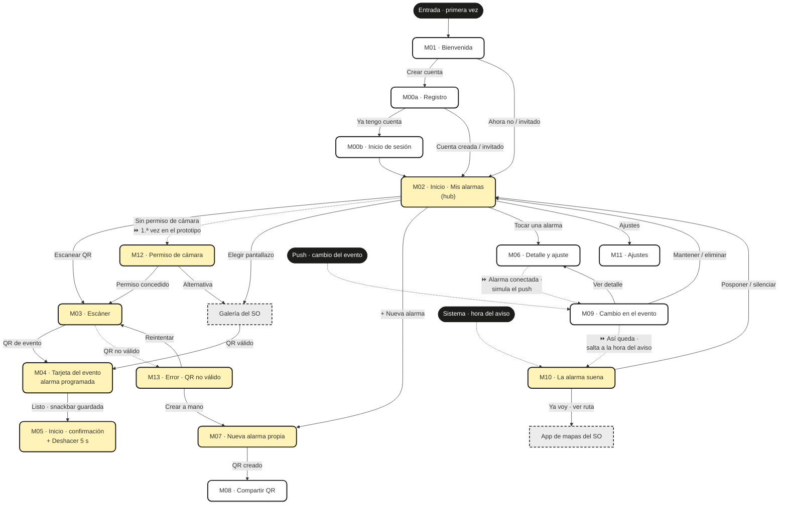
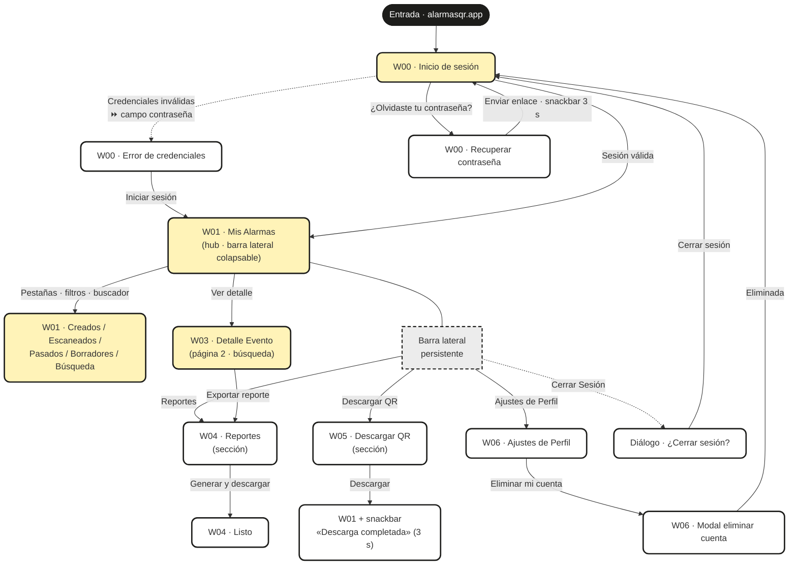

# Alarmas QR · Mapa de navegación (móvil) y mapa de sitio (web)

Estructura en árbol que conecta lógicamente todas las pantallas de cada aplicación, mostrando los accesos habilitados desde cada pantalla hacia las demás.
Fecha: 2026-08-23 · Actualizado 2026-09-06 (recorrido unificado del prototipo y áreas de toque, §6) · Insumos: `USER_FLOWS.md` (flujos MVP), `LISTA_MVP.md`, mockups M/W.
Exportables: `Mapa_Navegacion_Movil.pdf` y `Mapa_Sitio_Web.pdf` (raíz).

**Convenciones:** amarillo suave = pantalla usada por los flujos del MVP · blanco = pantalla de fases posteriores · gris punteado = sistema externo (SO, galería, mapas) o componente persistente · negro = punto de entrada (usuario o sistema) · flecha punteada = entrada por notificación/error · ⏩ = disparador simulado del prototipo (reemplaza al evento externo para poder recorrerlo de principio a fin).

## 1 · Pantallas por flujo — aplicación móvil

| Flujo | Nombre | Nº pantallas | Pantallas | Retroalimentación del sistema |
|---|---|---|---|---|
| UF-M02.1 | Consultar alarmas | 2 | M02 · M06 (salida a detalle) | Badges «Nueva» / «Mía · QR», anticipación visible, nube = conectada |
| UF-M03.1 | Escanear con cámara | 3 + 2 desvíos | M02 → M03 → M04 · desvíos M12, M13 | Vibración al detectar, linterna automática, marco guía |
| UF-M03.2 | Importar pantallazo | 4 | M02/M03 → galería (SO) → M04 · desvío M13 | «No se pudo leer» si el QR no es legible |
| UF-M04.1 | Revisar alarma programada | 2 | M04 → M05 | «Guardada automáticamente», snackbar «Alarma guardada · También en Google Calendar» |
| UF-M07.1 | Crear alarma propia + QR | 3 | M02 → M07 → M08 | Validación inline del título (obligatorio); el QR del evento se genera al guardar |
| UF-M10.1 | Atender la alarma | 2 | M10 → app de mapas (SO) | Sonido o vibración según «No molestar», «Sal en X min», re-aviso a los 5 min |
| UF-M12.1 | Conceder permiso de cámara | 3 | M12 → ajustes del SO → M03 | Por qué se pide el permiso, estado del permiso al volver |

## 2 · Pantallas por flujo — aplicación web

| Flujo | Nombre | Nº pantallas | Pantallas | Retroalimentación del sistema |
|---|---|---|---|---|
| UF-W00.1 | Iniciar sesión | 2 | W00 → W01 | Error de credenciales, «Te enviamos un correo de recuperación» |
| UF-W01.1 | Consultar el tablero | 2 | W01 · salida a W02 | Métricas y gráfica recargadas al cambiar el rango; «datos agregados y anónimos» |
| UF-W02.1 | Revisar mis eventos | 3 | W02 → W03 (propio) · estado de alarma (escaneado) | Resultados de búsqueda, tags «Propio»/«Escaneado», «Sin resultados con estos filtros» |

**Mockups web (página `03 · Web`, web v1.5 del 2026-09-19):** W02 vive dentro de W01 como pestañas (Todos / Creados / Escaneados) y estados (Pasados / Borradores / Búsqueda); W04 y W05 son secciones propias (fueron modales del 14 al 19 de septiembre); W07 es el modal «Eliminar cuenta»; W00 tiene error de credenciales y recuperación de contraseña, y «Cerrar Sesión» pasa por un diálogo; ver §4 y §6b.

## 3 · Mapa de navegación — aplicación móvil

El hub es **M02 (Mis alarmas)**: toda la navegación del asistente sale y regresa allí. Hay tres puntos de entrada: el arranque (M01 → registro/login/invitado), la **notificación push** (M09) y el **disparo del sistema** (M10). En la app real esos dos últimos los dispara un evento externo; en el prototipo de Figma se simulan con las flechas ⏩ para que el recorrido sea uno solo (ver §6).

## 4 · Mapa de sitio — aplicación web

Árbol de sitio con **W00 como compuerta** y **W01 (Mis Alarmas) como hub**, con la barra lateral persistente (colapsable desde la web v1.4) dando acceso a las secciones Reportes, Descargar QR y Ajustes de Perfil. Redibujado el 2026-09-19 con la estructura de los **mockups web v1.5**: W02 vive en W01 como pestañas y estados, W04 y W05 son secciones (ya no modales), W00 tiene error y recuperación de contraseña, y «Cerrar Sesión» pasa por un diálogo. Profundidad máxima: 3 niveles (W00 → W01/nav → W03 → W04).

## 5 · Lectura del árbol (decisiones de estructura)

- **Móvil = hub-and-spoke, no jerarquía profunda:** ninguna pantalla queda a más de 2 toques de M02; los errores (M12, M13) son desvíos del flujo de captura que siempre devuelven al camino o a una alternativa (galería, M07) — nunca un callejón sin salida.
- **Web = árbol de sitio de 3 niveles** con navegación lateral persistente: cualquier sección es alcanzable en 1 clic desde cualquier otra; W07 es un modal sobre W06, no una sección.
- **Mockups web (2026-09-14 → 2026-09-19):** W01 «Mis Alarmas» concentra tablero + lista (W02 vive como pestañas y estados). Del 14 al 19 de septiembre W04 y W05 eran modales sobre W01 (árbol de 2 niveles); desde la web v1.5 vuelven a ser secciones y el mapa de §4 describe esta estructura. El diálogo «¿Cerrar sesión?» y el modal de eliminar cuenta son las dos confirmaciones de la web.
- **La retroalimentación acompaña cada transición** (snackbar de guardado, vibración de detección, errores de login) y está detallada por flujo en las tablas 1 y 2.

## 6 · Recorrido unificado del prototipo (Figma)

Hasta el 2026-09-01 el prototipo móvil tenía **cuatro puntos de inicio** (M01 principal, M09 push, M10 sistema, M12 desvío) porque M09, M10 y M12 los dispara un evento externo que Figma no puede reproducir. Para que quien prueba pueda entrar por M01 y recorrer la aplicación **de principio a fin sin cambiar de flujo**, esos tres disparadores se simulan con elementos que ya existen en las pantallas (⏩). El prototipo web ya era un único flujo desde W00 y no cambia.

Prototipo publicado (abre en M01): https://www.figma.com/proto/epn1MSPTAFtO0pDOcPdbAv/Wireframes-Alarmas-QR-Equipo-UX?node-id=3-131&p=f&scaling=min-zoom&content-scaling=fixed&page-id=1%3A6&starting-point-node-id=3%3A71&show-proto-sidebar=1

| Paso | Pantalla | Acción de quien prueba | Llega a | Qué simula |
|---|---|---|---|---|
| 1 | M01 Bienvenida | «Comenzar» / «Crear cuenta» | M00a → M02v (sin alarmas; en los wireframes M02) · «Entrar» en M00b → M02 | Arranque real |
| 2 | M02 / M02v Inicio | Mockups v1.3: toque del FAB «Escanear» (mantener presionado ≥ 0,5 s abre la hoja M02h con QR · pantallazo · a mano); M02v: botón «Escanear QR del evento». Wireframes: botón «Escanear QR del evento» | **M12** Permiso de cámara | ⏩ Primer uso: la app aún no tiene permiso de cámara |
| 3 | M12 Permiso | «Abrir ajustes» | M03 Escáner | ⏩ El permiso se concede en el SO y se vuelve a la app |
| 3b | M12 Permiso | «Elegir pantallazo» · «Crear el evento a mano» | M03b → M04 (mockups; wireframes directo a M04) · M07 | Alternativas sin cámara; M03b simula el pantallazo compartido desde WhatsApp |
| 4 | M03 Escáner | Tocar «Apunta al código QR del evento» | M04 Tarjeta del evento | Lectura del QR |
| 4b | M03 Escáner | Tocar «vibra al detectar el código» | M13 → «Volver a escanear» → M03 | Desvío anti-quishing |
| 5 | M04 Tarjeta (hoja inferior sobre M02 desde el 2026-09-17; el velo también cierra → M02) | «Listo» | M05 Inicio + snackbar | Alarma guardada |
| 6 | M05 Inicio | Tocar la alarma nueva «Entrega de proyecto UX» | M06 Editar alarma | Consultar detalle |
| 7 | M06 Editar | Fila «Alarma conectada · Confirmar antes de auto-ajustarse» | **M09** Cambio en el evento | ⏩ Llega el push del organizador |
| 8 | M09 Cambio | «Aceptar cambio» (desde el 2026-09-17; antes «Perfecto, así queda» / mockups «Aceptar el cambio») | **M10** La alarma suena | ⏩ Salto temporal a las 4:45 pm, la hora recalculada |
| 8b | M09 Cambio | «Mantener alarma» (antes «Mantener mi alarma anterior» / «Mantener mi alarma de 3:15 pm»; en los mockups también «×») | M02 | Rechazo del cambio; en los mockups «Eliminar» ya no está en M09 |
| 9 | M10 Suena | «Ya voy» · «Posponer 10 min» · «Ver ruta ›» dentro del destacado (wireframes: «Ya voy · ver ruta», selector 5/10/15 y «Silenciar solo esta vez») | M02 | Cierre del ciclo (la app de mapas es externa) |

Ramas laterales que siguen disponibles desde M02: hoja M02h «Crear el evento a mano» (wireframes: «+») → M07 → M08 → M02, «Calendario» → M02b, «Ajustes» → M11. **Mockups v1.1 (2026-09-08):** el archivo de mockups (`4nHD4ygcnP33UH0gAhaii5`) añade M02v, M02h y M03b sin nuevos puntos de inicio; 67 conexiones. Los FAB de M02, M02b y M05 abren la cámara con un toque y la hoja M02h al mantenerlos presionados (desde el 2026-09-14: toque = «Mouse up» sin retardo, mantener = «Mouse down» con retardo de 0,5 s; antes «On tap» + «While pressing», que revertía al soltar y hacía que la hoja destellara y el prototipo saltara a M12; el fondo de M02h es la lista de M02). Desde la v1.3 son 72 conexiones; desde el 2026-09-17 (diálogos de confirmación, abajo) son **82** en los mockups y **72** en los wireframes (antes 59).

**Diálogos de confirmación (2026-09-17, comentario general de los tutores sobre la navegación: «agregar modales de verificación y prevención de errores, por ejemplo al dar clic en eliminar»).** Ninguna acción destructiva o de salida navega ya directo: el control abre un marco `M0xd` que es la pantalla de origen atenuada (clon sin conexiones) + velo Tinta 55 % + diálogo centrado de 342 pt con título, consecuencia y dos botones de máximo dos palabras: la acción segura es el primario relleno («Conservar» / «Cancelar») y la acción que confirma va en contorno (Coral si destruye, Tinta si solo sale). El velo y la acción segura vuelven a la pantalla de origen; la acción confirmada va al destino que antes tenía el enlace.

| Diálogo | Se abre desde | Acción segura → | Acción confirmada → | Archivos |
|---|---|---|---|---|
| M04d · ¿Eliminar alarma? | M04 «Eliminar alarma · no puedo asistir» | M04 | M02 | wireframes `2368:2` · mockups `4330:1432` |
| M06d · ¿Eliminar alarma? | M06 «Eliminar alarma» | M06 | M02 | wireframes `2367:2` · mockups `4329:1432` |
| M09d · ¿Eliminar alarma? | M09 «Eliminar alarma» | M09 | M02 | solo wireframes `2369:2` (en los mockups M09 no tiene «Eliminar» desde la v1.1) |
| M11d · ¿Cerrar sesión? | M11 fila «Cerrar sesión» (antes sin conexión) | M11 | **M01** (salida) | wireframes `2370:2` · mockups `4331:1448` |

Los diálogos no son puntos de inicio ni aparecen en el recorrido principal de la tabla: se prueban desde el paso 5 (M04), el paso 6 (M06), el 8b (M09) o la rama «Ajustes».

**Decisiones:** (a) el permiso se pide una sola vez porque solo el botón de M02 pasa por M12; los reintentos desde M13 y las alternativas van directo a M03/M04. (b) M09 y M10 se encadenan porque M09 anuncia "sonará 4:45 pm" y M10 muestra exactamente esa alarma, así el salto temporal se lee sin explicación. (c) No se agregaron elementos nuevos a las pantallas: todos los disparadores ⏩ son controles existentes, así el wireframe sigue representando la app real. (d) **Áreas de toque (2026-09-06):** las conexiones se cuelgan del marco del control (botón, pestaña, chip, tarjeta, ítem de barra lateral), no del texto; en la prueba se notó que había que tocar exactamente la palabra. Donde el control no tiene marco propio, la caja de texto se agrandó con tamaño fijo y alineación centrada: flechas «‹» de volver a 44×44 px, «Deshacer · 5 s» a 110×26, «Ver ›» de la tabla web a la altura de la fila. Se dejan en texto, a propósito, los casos cuyo único contenedor es una zona grande (visor de cámara en M03, enlaces de pie en M00a/M00b, título del cambio en M09, miga de pan en W03) para no volver tocable toda la pantalla. Aplica a móvil (59 conexiones) y web (44). (e) **Prevención de errores (2026-09-17):** toda acción irreversible (eliminar) o de salida (cerrar sesión) pasa por un diálogo de confirmación con la acción segura prominente; el prototipo lo simula con marcos `M0xd` porque Figma no permite posicionar overlays desde el Plugin API (misma técnica que M04 y M02h).

### 6b · Recorrido del prototipo web en los mockups (2026-09-14)

**Wireframes web (2026-09-17):** el archivo de wireframes tiene ahora una página `03 · Web` nueva (`2165:2`) construida por mmatallanar-ua con la misma estructura que los mockups (14 marcos, un solo punto de inicio «Inicio» en W00 `2165:3`, 102 conexiones), y la página W00–W07 original quedó como «03 · Web - Copy» (`1:7`). Prototipo: https://www.figma.com/proto/epn1MSPTAFtO0pDOcPdbAv/Wireframes-Alarmas-QR-Equipo-UX?node-id=2165-3&p=f&scaling=min-zoom&content-scaling=fixed&page-id=2165%3A2&starting-point-node-id=2165%3A3&show-proto-sidebar=1 — el recorrido de la tabla siguiente aplica igual. Tras la revisión de los tutores, en los dos archivos el paso «Descargar» de W05 lleva a **W01 con la snackbar «Descarga completada exitosamente»** (ya no al modal) y ese marco vuelve solo a W01 a los 3 s (disparador «After delay», el primero del proyecto).

Prototipo publicado (abre en W00, un solo punto de inicio «Inicio» `4072:1861`, 109 conexiones «On tap» con Smart Animate 250 ms desde la web v1.1; 126 y 15 marcos desde la web v1.4 del 2026-09-19, con la barra lateral colapsable; 220 y 24 marcos desde la web v1.5 del mismo día, con la propuesta de pantallas ejecutada): https://www.figma.com/proto/4nHD4ygcnP33UH0gAhaii5/Mockups-Alarmas---QR-Equipo-UX?node-id=4072-1861&p=f&scaling=min-zoom&content-scaling=fixed&page-id=4072%3A2&starting-point-node-id=4072%3A1861&show-proto-sidebar=1

| Paso | Pantalla | Acción de quien prueba | Llega a | Qué simula |
|---|---|---|---|---|
| 1 | W00 Inicio de sesión | «Iniciar sesión» | **W01** Mis Alarmas (Todos) | Sesión válida |
| 1b | W01 Mis Alarmas | Control «colapsar menú» (doble chevrón, arriba de la barra lateral) · «expandir menú» | **W01 (menú colapsado)**, barra de 64 solo con iconos · W01 | Barra lateral colapsable (2026-09-19, comentario del tutor); los iconos conservan sus destinos |
| 2 | W01 Mis Alarmas | Pestañas «Creados» / «Escaneados» · «Todos» | W01 (Creados) · W01 (Escaneados) · W01 | Filtro por origen del evento (F-W02, F-W06) |
| 3 | W01 Mis Alarmas | «Ver detalle ›» de un evento | **W03** Detalle Evento | Monitoreo anónimo (F-W03) |
| 3b | W03 Detalle | Miga de pan «‹ Mis alarmas» · «Mis Alarmas» en la barra lateral | W01 | Volver al hub |
| 3c | W01 Mis Alarmas | Leer la tarjeta «Escaneos por semana» bajo la tabla (sin conexión) | — | Tablero F-W01: 8 semanas, total 128 |
| 4 | W01 / barra lateral / W03 | «Exportar reporte» · «Reportes» | **W04** Reportes (sección, web v1.5; modal hasta la v1.4) | F-W04 |
| 4b | W04 Reportes | «Rango personalizado» → fechas → «Generar y descargar» · «Cancelar» / miga «‹ Mis alarmas» | W04 (Rango personalizado) → W04 (Listo) · W01 | Reporte generado («Generar de nuevo» vuelve al inicio de la sección) |
| 5 | W01 / barra lateral | «Descargar QR en lote» · «Descargar QR» | **W05** Descargar QR (sección, web v1.5; modal hasta la v1.4) | F-W05 |
| 5b | W05 Descargar QR | «Descargar» · «Cancelar» / miga «‹ Mis alarmas» | W01 con la snackbar «Descarga completada» (marco «W05 · Completado», vuelve solo a W01 a los 3 s) · W01 | Descarga completada (2026-09-17: el modal se cierra al completar, ya no queda abierto) |
| 6 | Barra lateral · avatar | «Ajustes de Perfil» · nombre del usuario | **W06** Ajustes de Perfil | F-W07 |
| 6b | W06 | «Guardar cambios» | W06 (Actualizado) con snackbar «Perfil actualizado» | Perfil guardado |
| 7 | W06 | «Eliminar mi cuenta» | **W06 · Modal eliminar cuenta** | F-W08 |
| 7b | Modal eliminar | «Conservar mi cuenta» · «Eliminar definitivamente» | W06 · **W00** (cuenta eliminada) con snackbar | Cierre del ciclo |
| 8 | Cualquier pantalla | «Cerrar Sesión» | **Diálogo · ¿Cerrar sesión?** (web v1.5) · «Cancelar» o el velo → W01 · «Cerrar sesión» → W00 | Confirmación antes de salir |
| 9 | W00 Inicio de sesión | Tocar el campo «Contraseña» (⏩) · «¿Olvidaste tu contraseña?» | **W00 (error de credenciales)** · **W00 (Recuperar contraseña)** | Credenciales inválidas · recuperación (web v1.5) |
| 9b | W00 Recuperar contraseña | «Enviar enlace» · «‹ Volver a iniciar sesión» | W00 con la snackbar «Te enviamos un correo de recuperación…» (vuelve sola a los 3 s) · W00 | Correo enviado |
| 10 | W01 (cualquier estado) | Segmento «Pasados» · «Borradores» · tocar el buscador | **W01 (Pasados)** · **W01 (Borradores · sin resultados)** · **W01 (Búsqueda)**; «Próximos», «Ver todos» y «Limpiar» vuelven a W01 | Filtros y búsqueda (F-W02, F-W06) |
| 11 | W03 Detalle | «2» / «›» del paginador · tocar «Buscar asistente» · «Exportar reporte» | **W03 (página 2)** · **W03 (búsqueda de asistente)** · W04 | Paginación, búsqueda y exportación desde el detalle (F-W03, F-W04) |

**Áreas de toque (web v1.1, 2026-09-14):** ya no hay conexiones sobre texto: «Ver detalle ›» cuelga de su marco, la fila de cabecera de cada modal (miga + «✕») es un solo control que cierra → W01 y la miga de W03 tiene su propio marco. Detalle en `MOCKUPS.md` §7.4.

## 7 · Sincronía con el código (2026-09-24)

La maquetación vive en `alejortizp/alarmas-qr-app` (Kotlin + Compose y Angular) y copia `docs/` de este
repositorio. Al construir las pantallas aparecieron frases de esta documentación que ningún mockup respalda. El
orden de precedencia que sigue el equipo es:

1. **Los mockups de Figma** (`MOCKUPS.md` §5, archivo `4nHD4ygcnP33UH0gAhaii5`) — mandan sobre todo lo demás.
2. **`handoff/TRAZABILIDAD.md`**, la tabla pantalla → ruta → destinos que el código implementa literalmente.
3. Este documento y `FUNCIONALIDADES.md`, que describen el recorrido y el contrato funcional.

Si una frase contradice un marco de Figma, **se corrige la frase**. Esta tabla deja registradas las divergencias
ya resueltas, para que nadie vuelva a implementar contra un texto que no corresponde a ningún mockup:

| Divergencia | Qué decía el documento | Qué manda | Resolución |
|---|---|---|---|
| **M06 → M08 «Compartir»** | El mermaid de §3 dibujaba esa arista y F-M08 hablaba del QR de «cualquier alarma guardada» | El marco `5:2` de M06 **no tiene ningún control de compartir** (verificado nodo por nodo) y TRAZABILIDAD tampoco lo lista | Arista retirada del mermaid y F-M08 reescrito. A M08 solo se llega desde M07 «Guardar y crear QR» |
| **M08 «‹»** | TRAZABILIDAD decía «‹» → M02 | El código vuelve a **M05**, la misma confirmación del flujo de escaneo, para que la alarma recién creada a mano también se vea resaltada una vez | Documentado en TRAZABILIDAD; el prototipo puede seguir yendo a M02, que es el mismo hub |
| **M02b · selector «Lista / Mes»** | No aparecía en TRAZABILIDAD, y la decisión (c) de §6 dice que no se agregan elementos nuevos | El marco `4:2` de M02b **sí dibuja** el selector segmentado en la barra superior | Fila de TRAZABILIDAD completada; el selector es del mockup, no un invento del código |
| **M04 «Editar»** | La fila M04 de TRAZABILIDAD solo listaba «Listo» → M05 y el descarte → M04d | El bloque «Sonará» del marco de M04 trae el enlace «Editar», y F-M04 habla del aviso calculado «editable» | Destino «Editar» → M06 añadido a TRAZABILIDAD |
| **M07 · validación** | UF-M07.1 pedía «validación inline» sin decir sobre qué campo | El título es el único campo obligatorio del marco `5:60` | Precisado en la tabla de §1: con el título vacío no se crea nada |
| **Filas de ajuste de 40 pt** | La revisión de tutores del 2026-09-17 fijó filas de ajuste de 40 (comentario 8) | La regla de área táctil mínima de 48 del mismo Design System | Manda la accesibilidad: en la app la fila que **navega** mide 48 y la que solo lleva un switch se queda en 40. Los mockups no cambian |
| **Peso de las horas grandes** | DS §7 y `design-tokens.json` decían Bold 700 | El trazo que muestran los marcos de M09 y M10 solo se reproduce en Android pidiendo 900 | Design System v1.12 y tokens v1.20 en 900 |

**Disparadores ⏩ tal como quedaron en la app:** el visor de M03 y «vibra al detectar el código» simulan la lectura
del QR; «Abrir ajustes» de M12 pide el permiso real de cámara; la fila «Confirmar antes de auto-ajustarse» de M06
abre M09 **solo en las alarmas que traen un cambio del organizador en `dataset.json`** (`a-entrega`, `a-semillero`
y `a-tutor`), porque en las demás no hay push que simular; y «Aceptar cambio» de M09 lleva a M10.
