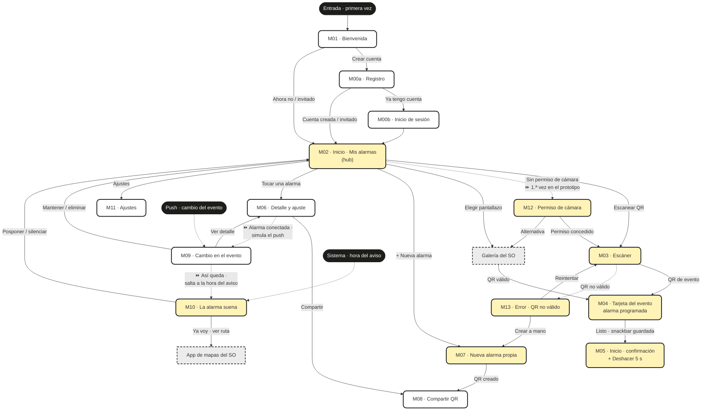
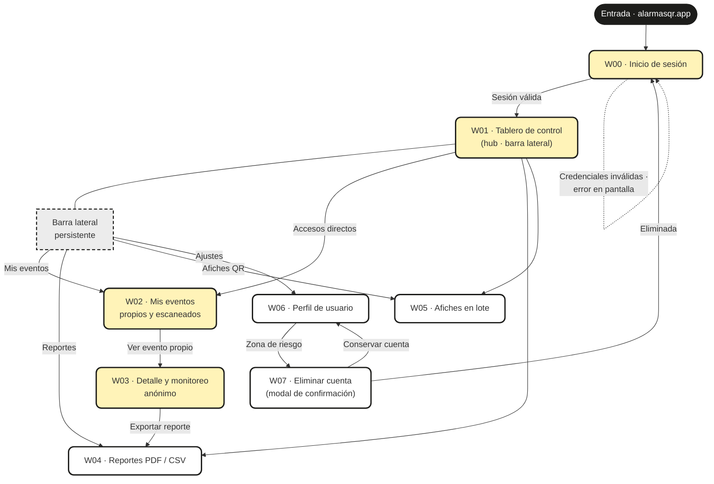

# Alarmas QR · Mapa de navegación (móvil) y mapa de sitio (web)

Estructura en árbol que conecta lógicamente todas las pantallas de cada aplicación, mostrando los accesos habilitados desde cada pantalla hacia las demás.
Fecha: 2026-08-23 · Actualizado 2026-09-06 (recorrido unificado del prototipo y áreas de toque, §6) · Insumos: `USER_FLOWS.md` (flujos MVP), `LISTA_MVP.md`, mockups M/W.
Exportables: `Mapa_Navegacion_Movil.pdf` y `Mapa_Sitio_Web.pdf` (raíz).

**Convenciones:** amarillo suave = pantalla usada por los flujos del MVP · blanco = pantalla de fases posteriores · gris punteado = sistema externo (SO, galería, mapas) o componente persistente · negro = punto de entrada (usuario o sistema) · flecha punteada = entrada por notificación/error · ⏩ = disparador simulado del prototipo (reemplaza al evento externo para poder recorrerlo de principio a fin).

## 1 · Pantallas por flujo — aplicación móvil

| Flujo | Nombre | Nº pantallas | Pantallas | Retroalimentación del sistema |
|---|---|---|---|---|
| UF-M02.1 | Consultar alarmas | 2 | M02 · M06 (salida a detalle) | Badges «Nueva» / «Mía · QR», anticipación visible, nube = conectada |
| UF-M03.1 | Escanear con cámara | 3 + 2 desvíos | M02 → M03 → M04 · desvíos M12, M13 | Vibración al detectar, linterna automática, marco guía |
| UF-M03.2 | Importar pantallazo | 4 | M02/M03 → galería (SO) → M04 · desvío M13 | «No se pudo leer» si el QR no es legible |
| UF-M04.1 | Revisar alarma programada | 2 | M04 → M05 | «Guardada automáticamente», snackbar «Alarma guardada · También en Google Calendar» |
| UF-M07.1 | Crear alarma propia + QR | 3 | M02 → M07 → M05 (opcional M08) | Validación inline, «Alarma y QR creados» |
| UF-M10.1 | Atender la alarma | 2 | M10 → app de mapas (SO) | Sonido o vibración según «No molestar», «Sal en X min», re-aviso a los 5 min |
| UF-M12.1 | Conceder permiso de cámara | 3 | M12 → ajustes del SO → M03 | Por qué se pide el permiso, estado del permiso al volver |

## 2 · Pantallas por flujo — aplicación web

| Flujo | Nombre | Nº pantallas | Pantallas | Retroalimentación del sistema |
|---|---|---|---|---|
| UF-W00.1 | Iniciar sesión | 2 | W00 → W01 | Error de credenciales, «Te enviamos un correo de recuperación» |
| UF-W01.1 | Consultar el tablero | 2 | W01 · salida a W02 | Métricas y gráfica recargadas al cambiar el rango; «datos agregados y anónimos» |
| UF-W02.1 | Revisar mis eventos | 3 | W02 → W03 (propio) · estado de alarma (escaneado) | Resultados de búsqueda, tags «Propio»/«Escaneado», «Sin resultados con estos filtros» |

**Mockups web (2026-09-14, página `03 · Web`):** los tres flujos ocurren en menos pantallas porque W02 vive dentro de W01 como pestañas (Todos / Creados / Escaneados) y W04, W05 y W07 son modales; ver §6b.

## 3 · Mapa de navegación — aplicación móvil

El hub es **M02 (Mis alarmas)**: toda la navegación del asistente sale y regresa allí. Hay tres puntos de entrada: el arranque (M01 → registro/login/invitado), la **notificación push** (M09) y el **disparo del sistema** (M10). En la app real esos dos últimos los dispara un evento externo; en el prototipo de Figma se simulan con las flechas ⏩ para que el recorrido sea uno solo (ver §6).

## 4 · Mapa de sitio — aplicación web

Árbol clásico de sitio con **W00 como compuerta** y **W01 (Tablero) como hub**, con la barra lateral persistente dando acceso a las cuatro secciones. Profundidad máxima: 3 niveles (W00 → W01/nav → W02 → W03).

## 5 · Lectura del árbol (decisiones de estructura)

- **Móvil = hub-and-spoke, no jerarquía profunda:** ninguna pantalla queda a más de 2 toques de M02; los errores (M12, M13) son desvíos del flujo de captura que siempre devuelven al camino o a una alternativa (galería, M07) — nunca un callejón sin salida.
- **Web = árbol de sitio de 3 niveles** con navegación lateral persistente: cualquier sección es alcanzable en 1 clic desde cualquier otra; W07 es un modal sobre W06, no una sección.
- **Mockups web (2026-09-14):** el árbol se aplana a 2 niveles: W01 «Mis Alarmas» concentra tablero + lista (W02 desaparece como pantalla) y la barra lateral abre W04 y W05 como modales sobre W01; W03 es el único segundo nivel y el modal de eliminar cuenta cuelga de W06. El mapa Mermaid de §4 sigue describiendo la estructura de los wireframes.
- **La retroalimentación acompaña cada transición** (snackbar de guardado, vibración de detección, errores de login) y está detallada por flujo en las tablas 1 y 2.

## 6 · Recorrido unificado del prototipo (Figma)

Hasta el 2026-09-01 el prototipo móvil tenía **cuatro puntos de inicio** (M01 principal, M09 push, M10 sistema, M12 desvío) porque M09, M10 y M12 los dispara un evento externo que Figma no puede reproducir. Para que quien prueba pueda entrar por M01 y recorrer la aplicación **de principio a fin sin cambiar de flujo**, esos tres disparadores se simulan con elementos que ya existen en las pantallas (⏩). El prototipo web ya era un único flujo desde W00 y no cambia.

Prototipo publicado (abre en M01): https://www.figma.com/proto/epn1MSPTAFtO0pDOcPdbAv/Wireframes-Alarmas-QR-Equipo-UX?node-id=3-131&p=f&scaling=min-zoom&content-scaling=fixed&page-id=1%3A6&starting-point-node-id=3%3A71&show-proto-sidebar=1

| Paso | Pantalla | Acción de quien prueba | Llega a | Qué simula |
|---|---|---|---|---|
| 1 | M01 Bienvenida | «Comenzar» / «Crear cuenta» | M00a → M02v (sin alarmas; en los wireframes M02) · «Entrar» en M00b → M02 | Arranque real |
| 2 | M02 / M02v Inicio | Mockups v1.3: toque del FAB «Escanear» (mantener presionado ≥ 0,5 s abre la hoja M02h con QR · pantallazo · a mano); M02v: botón «Escanear QR del evento». Wireframes: botón «Escanear QR del evento» | **M12** Permiso de cámara | ⏩ Primer uso: la app aún no tiene permiso de cámara |
| 3 | M12 Permiso | «Abrir ajustes» | M03 Escáner | ⏩ El permiso se concede en el SO y se vuelve a la app |
| 3b | M12 Permiso | «Elegir pantallazo» · «Crear el evento a mano» | M03b → M04 (mockups; wireframes directo a M04) · M07 | Alternativas sin cámara; M03b simula el pantallazo compartido desde WhatsApp |
| 4 | M03 Escáner | Tocar «Apunta al código QR del evento» | M04 Tarjeta del evento | Lectura del QR |
| 4b | M03 Escáner | Tocar «vibra al detectar el código» | M13 → «Volver a escanear» → M03 | Desvío anti-quishing |
| 5 | M04 Tarjeta | «Listo» | M05 Inicio + snackbar | Alarma guardada |
| 6 | M05 Inicio | Tocar la alarma nueva «Entrega de proyecto UX» | M06 Editar alarma | Consultar detalle |
| 7 | M06 Editar | Fila «Alarma conectada · Confirmar antes de auto-ajustarse» | **M09** Cambio en el evento | ⏩ Llega el push del organizador |
| 8 | M09 Cambio | «Perfecto, así queda» (mockups: «Aceptar el cambio») | **M10** La alarma suena | ⏩ Salto temporal a las 4:45 pm, la hora recalculada |
| 8b | M09 Cambio | «Mantener mi alarma anterior» (mockups: «Mantener mi alarma de 3:15 pm», «×») | M02 | Rechazo del cambio; en los mockups «Eliminar» ya no está en M09 |
| 9 | M10 Suena | «Ya voy» · «Posponer 10 min» · «Ver ruta ›» dentro del destacado (wireframes: «Ya voy · ver ruta», selector 5/10/15 y «Silenciar solo esta vez») | M02 | Cierre del ciclo (la app de mapas es externa) |

Ramas laterales que siguen disponibles desde M02: hoja M02h «Crear el evento a mano» (wireframes: «+») → M07 → M08 → M02, «Calendario» → M02b, «Ajustes» → M11. **Mockups v1.1 (2026-09-08):** el archivo de mockups (`4nHD4ygcnP33UH0gAhaii5`) añade M02v, M02h y M03b sin nuevos puntos de inicio; 67 conexiones. Los FAB de M02, M02b y M05 abren la cámara con un toque y la hoja M02h al mantenerlos presionados (desde el 2026-09-14: toque = «Mouse up» sin retardo, mantener = «Mouse down» con retardo de 0,5 s; antes «On tap» + «While pressing», que revertía al soltar y hacía que la hoja destellara y el prototipo saltara a M12; el fondo de M02h es la lista de M02). Desde la v1.3 son 72 conexiones.

**Decisiones:** (a) el permiso se pide una sola vez porque solo el botón de M02 pasa por M12; los reintentos desde M13 y las alternativas van directo a M03/M04. (b) M09 y M10 se encadenan porque M09 anuncia "sonará 4:45 pm" y M10 muestra exactamente esa alarma, así el salto temporal se lee sin explicación. (c) No se agregaron elementos nuevos a las pantallas: todos los disparadores ⏩ son controles existentes, así el wireframe sigue representando la app real. (d) **Áreas de toque (2026-09-06):** las conexiones se cuelgan del marco del control (botón, pestaña, chip, tarjeta, ítem de barra lateral), no del texto; en la prueba se notó que había que tocar exactamente la palabra. Donde el control no tiene marco propio, la caja de texto se agrandó con tamaño fijo y alineación centrada: flechas «‹» de volver a 44×44 px, «Deshacer · 5 s» a 110×26, «Ver ›» de la tabla web a la altura de la fila. Se dejan en texto, a propósito, los casos cuyo único contenedor es una zona grande (visor de cámara en M03, enlaces de pie en M00a/M00b, título del cambio en M09, miga de pan en W03) para no volver tocable toda la pantalla. Aplica a móvil (59 conexiones) y web (44).

### 6b · Recorrido del prototipo web en los mockups (2026-09-14)

Prototipo publicado (abre en W00, un solo punto de inicio «Inicio» `4072:1861`, 109 conexiones «On tap» con Smart Animate 250 ms desde la web v1.1): https://www.figma.com/proto/4nHD4ygcnP33UH0gAhaii5/Mockups-Alarmas---QR-Equipo-UX?node-id=4072-1861&p=f&scaling=min-zoom&content-scaling=fixed&page-id=4072%3A2&starting-point-node-id=4072%3A1861&show-proto-sidebar=1

| Paso | Pantalla | Acción de quien prueba | Llega a | Qué simula |
|---|---|---|---|---|
| 1 | W00 Inicio de sesión | «Iniciar sesión» | **W01** Mis Alarmas (Todos) | Sesión válida |
| 2 | W01 Mis Alarmas | Pestañas «Creados» / «Escaneados» · «Todos» | W01 (Creados) · W01 (Escaneados) · W01 | Filtro por origen del evento (F-W02, F-W06) |
| 3 | W01 Mis Alarmas | «Ver detalle ›» de un evento | **W03** Detalle Evento | Monitoreo anónimo (F-W03) |
| 3b | W03 Detalle | Miga de pan «‹ Mis alarmas» · «Mis Alarmas» en la barra lateral | W01 | Volver al hub |
| 3c | W01 Mis Alarmas | Leer la tarjeta «Escaneos por semana» bajo la tabla (sin conexión) | — | Tablero F-W01: 8 semanas, total 128 |
| 4 | W01 / barra lateral | «Exportar reporte» · «Reportes» | **W04** modal Exportar reporte | F-W04 |
| 4b | W04 modal | «Rango personalizado» → fechas → «Generar y descargar» · «Cancelar» / «✕» | W04 (Rango personalizado) → W04 (Listo) · W01 | Reporte generado («Generar de nuevo» vuelve al inicio del modal) |
| 5 | W01 / barra lateral | «Descargar QR en lote» · «Descargar QR» | **W05** modal Descargar QR en lote | F-W05 |
| 5b | W05 modal | «Descargar» · «Cancelar» / «✕» | W05 (Completado) con snackbar · W01 | Descarga completada |
| 6 | Barra lateral · avatar | «Ajustes de Perfil» · nombre del usuario | **W06** Ajustes de Perfil | F-W07 |
| 6b | W06 | «Guardar cambios» | W06 (Actualizado) con snackbar «Perfil actualizado» | Perfil guardado |
| 7 | W06 | «Eliminar mi cuenta» | **W06 · Modal eliminar cuenta** | F-W08 |
| 7b | Modal eliminar | «Conservar mi cuenta» · «Eliminar definitivamente» | W06 · **W00** (cuenta eliminada) con snackbar | Cierre del ciclo |
| 8 | Cualquier pantalla | «Cerrar Sesión» | W00 | Salida |

**Áreas de toque (web v1.1, 2026-09-14):** ya no hay conexiones sobre texto: «Ver detalle ›» cuelga de su marco, la fila de cabecera de cada modal (miga + «✕») es un solo control que cierra → W01 y la miga de W03 tiene su propio marco. Detalle en `MOCKUPS.md` §7.4.