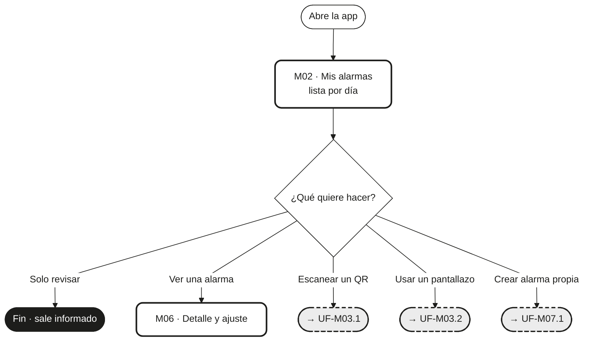
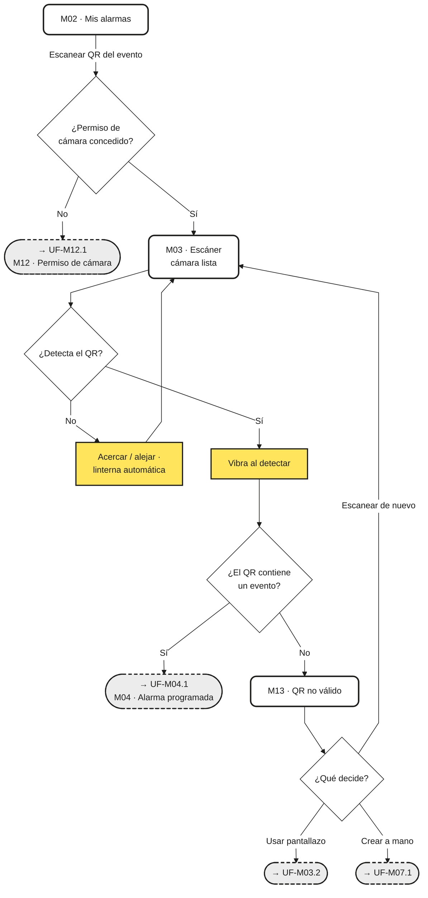
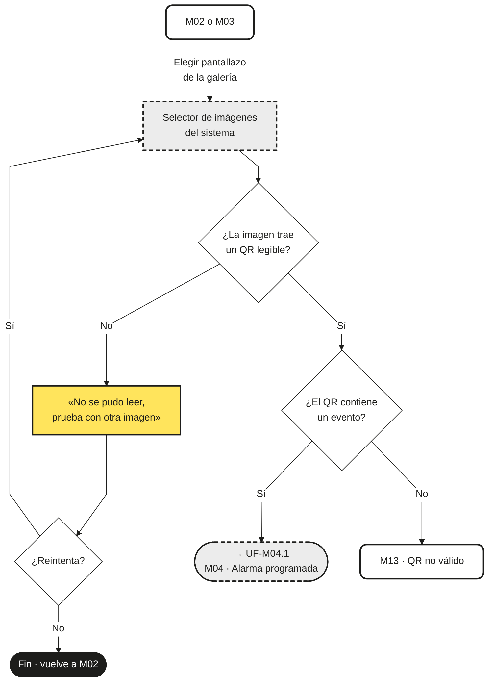
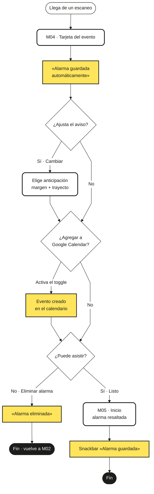
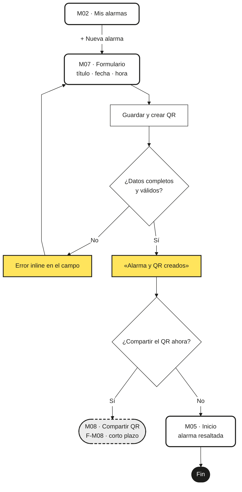
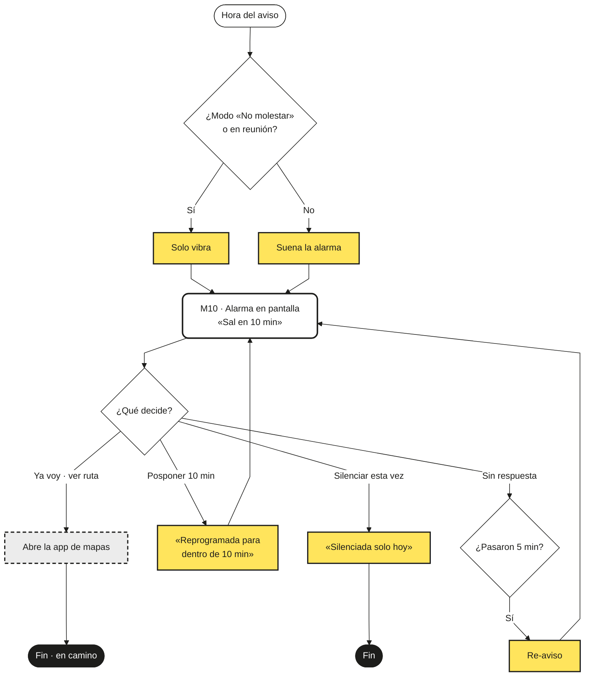
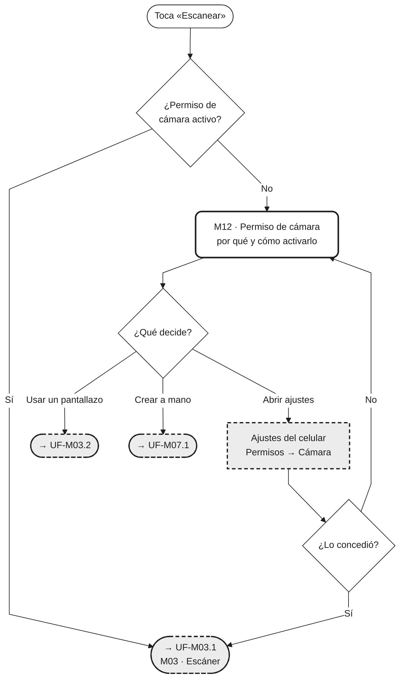
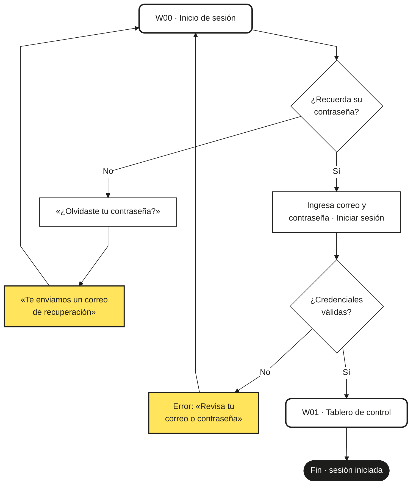
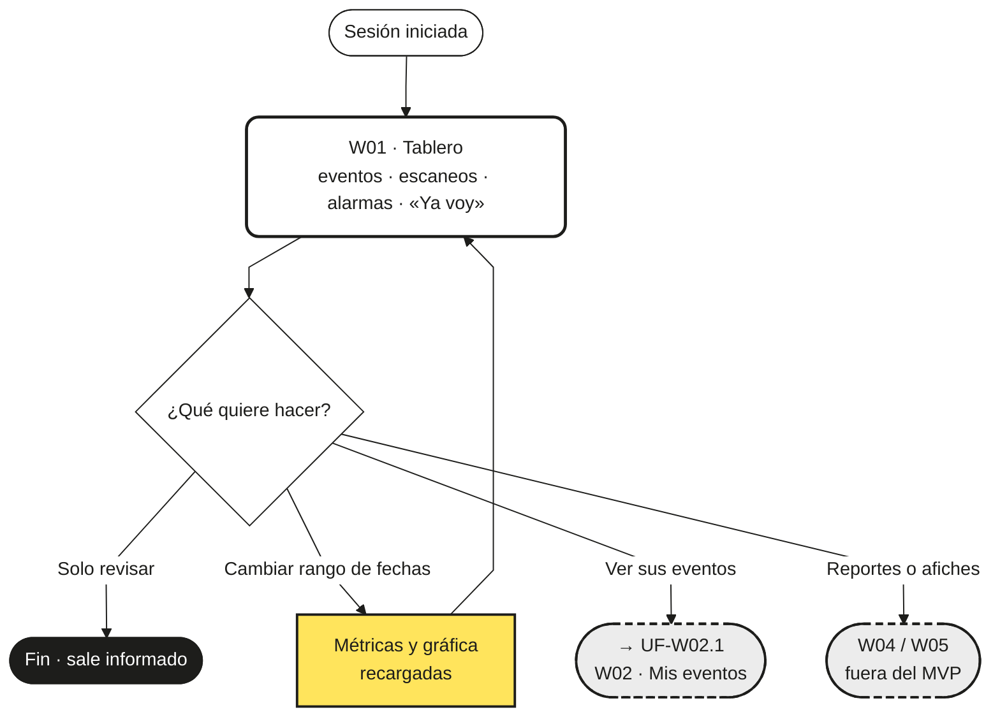
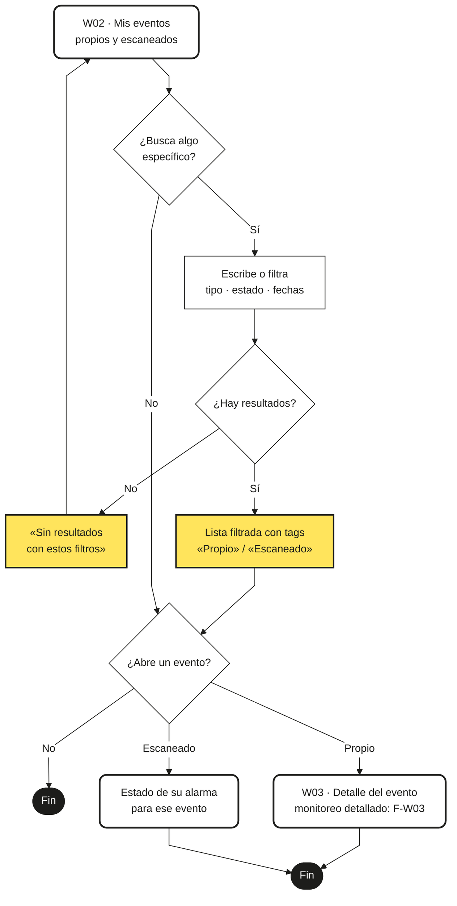

# Alarmas QR · User Flows del MVP

Flujos de usuario de las funcionalidades priorizadas en la columna **MVP** de la Lista MVP.
Fecha: 2026-08-23 · Insumo: `LISTA_MVP.md` · Catálogo: `FUNCIONALIDADES.md` · Pantallas: mockups M/W.
Exportables: `User_Flows_Movil.pdf` y `User_Flows_Web.pdf` (raíz del proyecto).

**Convenciones de los diagramas:** rectángulo con borde grueso = pantalla · rombo = decisión del usuario · amarillo = retroalimentación del sistema · gris punteado = sistema externo u otro flujo · negro = fin del flujo.

## Resumen: funcionalidades MVP → flujos

| Funcionalidad (MVP) | Flujos | Ids |
|---|---|---|
| F-M02 · Consulta de alarmas | 1 | UF-M02.1 |
| F-M03 · Escaneo dual de QR | 2 | UF-M03.1 · UF-M03.2 |
| F-M04 · Confirmación automática y descarte | 1 | UF-M04.1 |
| F-M07 · Creación manual + QR | 1 | UF-M07.1 |
| F-M10 · Disparo contextual | 1 | UF-M10.1 |
| F-M12 · Permisos de cámara | 1 | UF-M12.1 |
| **Móvil** | **7** | |
| F-W00 · Inicio de sesión general | 1 | UF-W00.1 |
| F-W01 · Tablero de métricas | 1 | UF-W01.1 |
| F-W02 · Eventos propios y escaneados | 1 | UF-W02.1 |
| **Web** | **3** | |

Conexiones externas del MVP: solo la **web** depende del Cloud Backend (API REST); el móvil MVP funciona con APIs nativas del SO (cámara, almacenamiento, alarmas exactas) y persistencia local. Google Calendar es opcional (si el usuario lo conectó) y el tráfico en tiempo real queda en largo plazo (F-M10-Ext).

---

## Flujos de la aplicación móvil (7)

### UF-M02.1 · Consultar las próximas alarmas — funcionalidad F-M02

- **Pantallas:** M02 (Inicio · Mis alarmas) · salidas: M06, M03, M07
- **Retroalimentación del sistema:** Badges «Nueva» y «Mía · QR», anticipación visible por alarma, ícono de nube (alarma conectada)
- **Conexiones externas / cloud:** Ninguna en MVP (persistencia local)

### UF-M03.1 · Escanear el QR con la cámara — funcionalidad F-M03

- **Pantallas:** M02 → M03 (Escáner) → M04 · desvíos: M12 (sin permiso), M13 (QR no válido)
- **Retroalimentación del sistema:** Vibración al detectar el código, linterna automática, marco guía de encuadre
- **Conexiones externas / cloud:** APIs nativas de cámara del SO; sin servicios cloud

### UF-M03.2 · Importar un pantallazo de la galería — funcionalidad F-M03

- **Pantallas:** M02 o M03 → selector de galería (SO) → M04 · desvío: M13
- **Retroalimentación del sistema:** Mensaje «No se pudo leer» si la imagen no trae un QR legible
- **Conexiones externas / cloud:** Lectura de almacenamiento del SO; sin servicios cloud

### UF-M04.1 · Revisar la alarma programada (o descartarla) — funcionalidad F-M04

- **Pantallas:** M04 (Tarjeta del evento) → M05 (Inicio con confirmación)
- **Retroalimentación del sistema:** «Guardada automáticamente al escanear», snackbar «Alarma guardada · También en Google Calendar» (el botón Deshacer pertenece a F-M05, mediano plazo)
- **Conexiones externas / cloud:** Google Calendar API solo si el usuario conectó calendario (opcional)

### UF-M07.1 · Crear una alarma propia y generar su QR — funcionalidad F-M07

- **Pantallas:** M02 → M07 (Nueva alarma) → M05 · salida opcional: M08 (F-M08, corto plazo)
- **Retroalimentación del sistema:** Validación inline de campos obligatorios, confirmación «Alarma y QR creados»
- **Conexiones externas / cloud:** Ninguna en MVP (QR generado localmente)

### UF-M10.1 · Atender la alarma cuando suena — funcionalidad F-M10

- **Pantallas:** M10 (pantalla completa) · salidas: app de mapas (SO), M02
- **Retroalimentación del sistema:** Sonido o solo vibración según «No molestar», «Sal en X min», reprogramación al posponer, re-aviso a los 5 min sin respuesta
- **Conexiones externas / cloud:** AlarmManager / UserNotifications (alarmas exactas, sin internet); ruta con app de mapas del SO — el cálculo de tráfico en vivo es F-M10-Ext (largo plazo)

### UF-M12.1 · Conceder el permiso de cámara — funcionalidad F-M12

- **Pantallas:** M12 (guía de permiso) → ajustes del SO → M03 · alternativas: galería, M07
- **Retroalimentación del sistema:** Explicación de por qué se pide («no guardamos fotos»), estado del permiso al volver
- **Conexiones externas / cloud:** Ajustes del sistema operativo (Android)

---

## Flujos de la aplicación web (3)

### UF-W00.1 · Iniciar sesión en la web — funcionalidad F-W00

- **Pantallas:** W00 (Login) → W01 (Tablero)
- **Retroalimentación del sistema:** Error de credenciales bajo el formulario, «Te enviamos un correo de recuperación»
- **Conexiones externas / cloud:** Cloud Backend / API REST (autenticación y sesión)

### UF-W01.1 · Consultar las métricas del tablero — funcionalidad F-W01

- **Pantallas:** W01 (Tablero) · salida: W02
- **Retroalimentación del sistema:** Métricas y gráfica recargadas al cambiar el rango de fechas; nota «datos agregados y anónimos»
- **Conexiones externas / cloud:** Cloud Backend / API REST (consulta de métricas agregadas)

### UF-W02.1 · Revisar mis eventos (propios y escaneados) — funcionalidad F-W02

- **Pantallas:** W02 (Mis eventos) → W03 (detalle básico) · el monitoreo detallado es F-W03 (corto plazo)
- **Retroalimentación del sistema:** Resultados al buscar, tags «Propio»/«Escaneado», estado vacío «Sin resultados con estos filtros»
- **Conexiones externas / cloud:** Cloud Backend / API REST (eventos de la cuenta)

